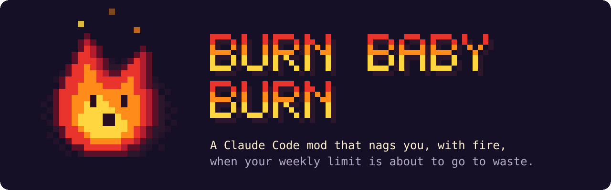
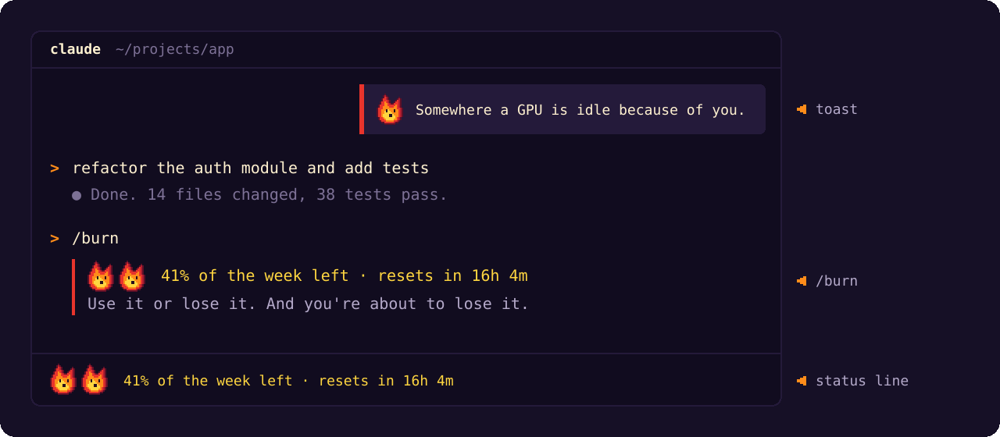
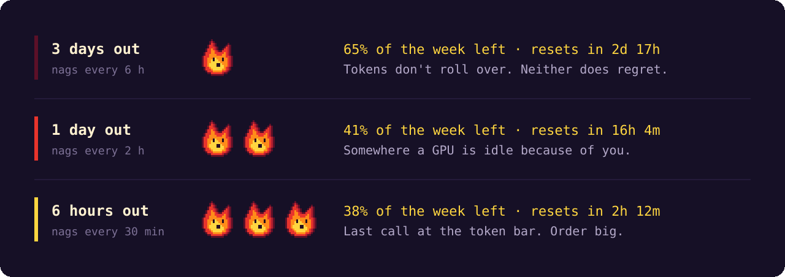

<p align="center">
  
</p>

<p align="center">
  <a href="https://claude.ai/directory"></a>
  
  
  
  <a href="LICENSE"></a>
</p>

<p align="center">
  <a href="#install">Install</a> &nbsp;·&nbsp;
  <a href="#the-closer-the-reset-the-hotter-it-gets">How it nags</a> &nbsp;·&nbsp;
  <a href="#what-it-does-on-your-machine">What it does on your machine</a> &nbsp;·&nbsp;
  <a href="#tweak">Tweak</a>
</p>

<br>

Your weekly usage limit resets whether you used it or not. **Burn Baby Burn** stays quiet for most
of the week. When the reset is close and a quarter or more of your limit is still unused, it starts
nagging you to use it.

<p align="center">
  
</p>

|                 |                                                                                  |
| --------------- | -------------------------------------------------------------------------------- |
| **Status line** | `🔥🔥 41% of the week left · resets in 16h 4m`, counting down live, even while you're idle. |
| **Toasts**      | A different quote each time, more often as the reset nears.                    |
| **`/burn`**     | Shows the status whenever you ask. It has something to say outside the window too. |

## The closer the reset, the hotter it gets

<p align="center">
  
</p>

It only nags in the last 72 hours before your weekly reset, and only while 25% or more of the week is
left. Use the limit up and it goes quiet again.

> Tokens don't roll over. Neither does regret.<br>
> We didn't start the fire, but 41% of your week says you should.<br>
> Ask Claude to rewrite it in Rust. You have 38% to spare.

There are 33 nag quotes, 11 per tier, plus replies for `/burn` before your first prompt, outside the
window, and on API keys, where there's no weekly limit to burn. They're all in
[`hooks/burn.ts`](hooks/burn.ts).

## Install

You need Claude Code 2.1.287 or later and a plan with a weekly limit. Burn Baby Burn is listed in the
Claude plugin directory:

```bash
claude plugin install burn-baby-burn@anthropic-plugin-directory --scope user
```

<details>
<summary>Other ways to install</summary>

<br>

In Claude Code, run `/plugin` and search for "Burn Baby Burn", or install it from
[claude.ai/directory](https://claude.ai/directory).

This repo is also its own marketplace:

```bash
claude plugin marketplace add eel-brah/burn-baby-burn
claude plugin install burn-baby-burn@burn-baby-burn --scope user
```

To try it without installing:

```bash
claude --plugin-dir /path/to/burn-baby-burn
```

</details>

## What it does on your machine

| Reads | Writes | Network | Commands |
| ----- | ------ | ------- | -------- |
| Claude Code's usage data for the session (only the weekly limit) and the clock, re-checked once a minute | When it last nagged and at which level, in Claude Code's plugin store | None | None |

It shows a status line and toasts, adds the `/burn` command, and touches no other files.

Its hooks (`hooks/register.ts`) only observe and always pass the event on unchanged:

- `session.start`: registers `/burn`, takes the first usage reading and starts the one-minute re-check.
- `session.measure`: re-checks when Claude Code reports new rate limits.
- `command.run` (only for `/burn`): answers with the current status; every other command is left alone.

> [!IMPORTANT]
> A mod runs inside Claude Code with the same access Claude Code has. Read the code (`hooks/`) before installing.

## Tweak

Everything is in [`hooks/burn.ts`](hooks/burn.ts): `MIN_LEFT` sets how much of the week must be left
before it nags, and the `TIERS` table sets when each level starts and how often it nags.

```ts
export const MIN_LEFT = 25

const TIERS = [
  { tier: 'inferno',  within: 6 * HOUR,  every: 30 * 60 * 1000 },
  { tier: 'blaze',    within: 24 * HOUR, every: 2 * HOUR },
  { tier: 'smoulder', within: 72 * HOUR, every: 6 * HOUR },
]
```

<br>

<p align="center">
  <sub>MIT licensed. Now go burn some tokens. 🔥</sub>
</p>
